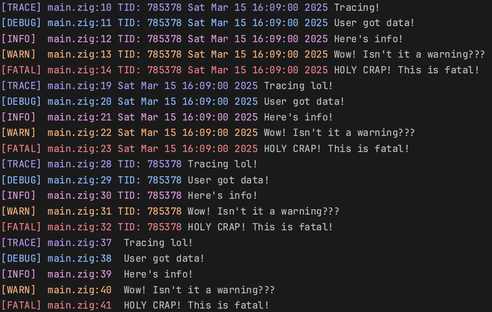

# Beauty



# Usage
```zig
const log = @import("root.zig");

pub fn main() !void {
    log.setLogLevel(log.LogLevel.trace);
    log.withTime(true);
    log.withThreadID(true);
    log.useThreadName(false); // note that threads are nameless by default

    log.debug(@src(), "User got data!", .{});
    log.trace(@src(), "Tracing!", .{});
    log.info(@src(), "Here's info!", .{});
    log.warn(@src(), "Wow! Isn't it a warning???", .{});
    log.fatal(@src(), "HOLY CRAP! This is fatal!", .{});
}
```
